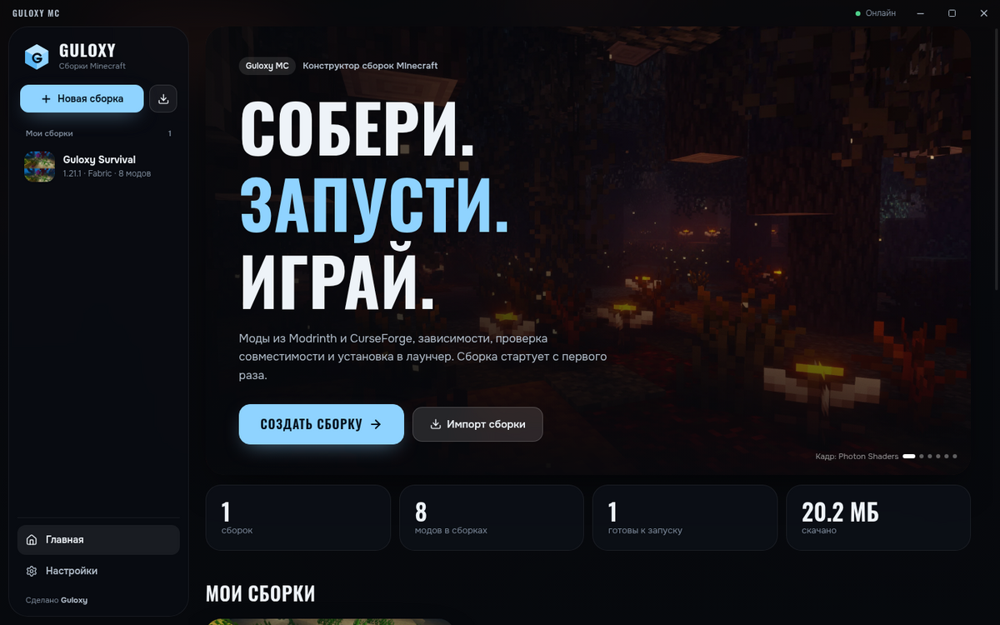
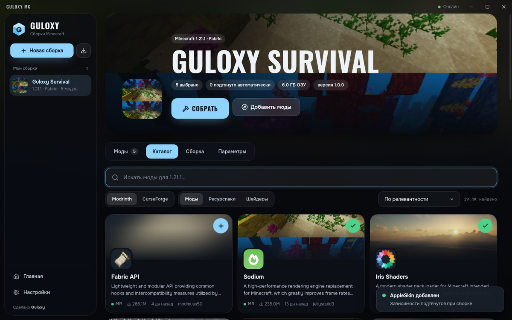
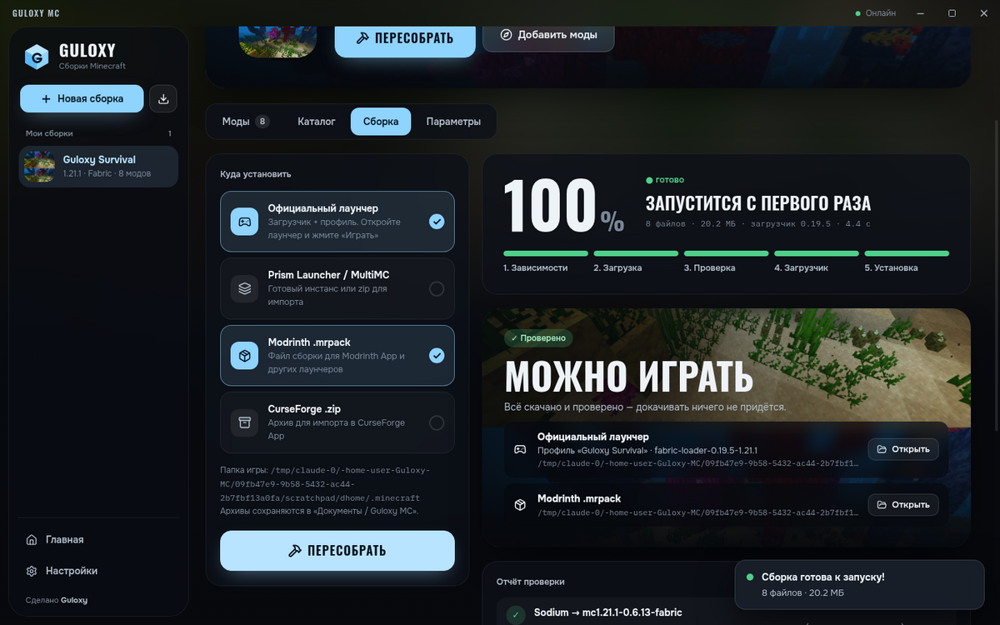
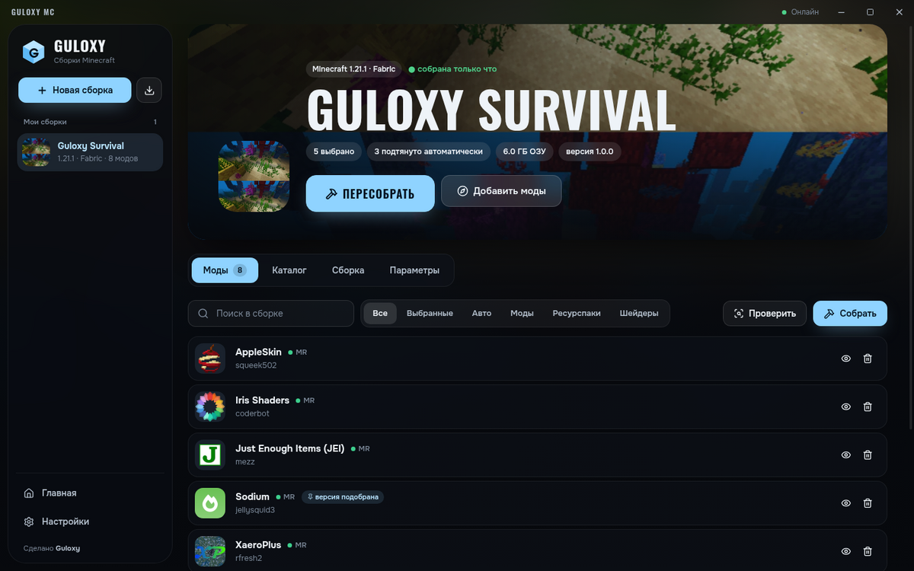
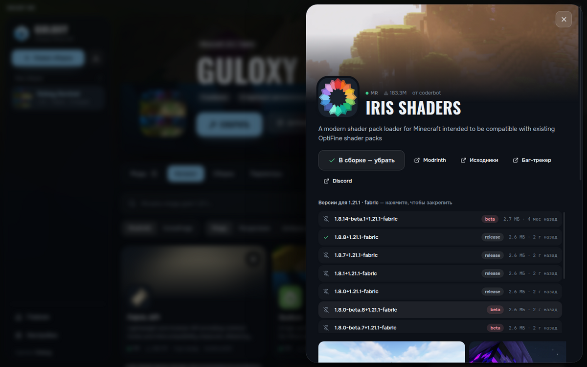
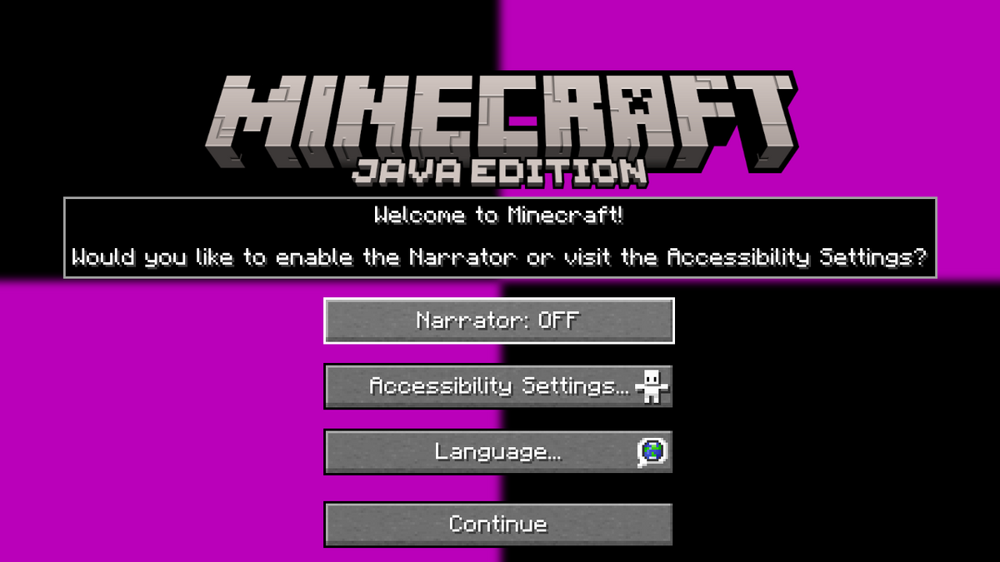

<div align="center">


# Guloxy MC

**Конструктор сборок Minecraft: моды из Modrinth и CurseForge, автодокачка зависимостей и проверка — сборка запускается с первого раза.**

Сделано командой **Guloxy**.

</div>



## Что умеет

- **Два источника.** Поиск модов, ресурспаков и шейдеров одновременно в Modrinth и CurseForge, фильтр по версии игры и загрузчику.
- **Fabric, Quilt, Forge, NeoForge.** Любая версия Minecraft, для которой есть загрузчик. Версия загрузчика берётся последняя стабильная или выбранная вручную.
- **Автодокачка зависимостей.** Библиотеки подтягиваются из метаданных Modrinth/CurseForge и рекурсивно, до последнего уровня.
- **Проверка самих JAR-файлов.** После скачивания каждый мод открывается и читаются `fabric.mod.json`, `quilt.mod.json`, `mods.toml`, `neoforge.mods.toml`, включая вложенные jar-in-jar. Проверяется:
  - все ли обязательные зависимости на месте (если чего-то нет — мод ищется и докачивается автоматически);
  - подходят ли версии Minecraft, загрузчика и Java;
  - нет ли модов, которые запрещают работу друг с другом (`breaks` / `incompatible`);
  - нет ли дубликатов одного мода из разных источников;
  - не помечен ли файл на сайте под чужой загрузчик.
- **Автоподбор совместимых версий.** Если моды конфликтуют по версиям (например, свежий Sodium и Iris, которому нужен Sodium 0.6.x), Guloxy MC перебирает версии и закрепляет ту, с которой всё работает.
- **Шейдеры «из коробки».** Добавили шейдер — Iris (или Oculus на Forge) появится в сборке сам.
- **Установка в один клик:**
  - **официальный лаунчер** — ставится загрузчик (Fabric/Quilt напрямую, Forge/NeoForge через их установщик), создаётся профиль с отдельной папкой игры, памятью и иконкой. Открыли лаунчер → «Играть»;
  - **TLauncher, Legacy Launcher и другие** — загрузчик ставится в `versions`, моды — в общую `.minecraft/mods` (прежние моды переносятся в `mods-disabled`); в лаунчере достаточно выбрать появившуюся версию;
  - **Prism Launcher / MultiMC** — готовый инстанс или zip для импорта;
  - **экспорт** в `.mrpack` (Modrinth) и `.zip` (CurseForge).
- **Импорт** готовых `.mrpack` и CurseForge-архивов для редактирования.
- **Java не нужна заранее.** Для установщика Forge/NeoForge приложение найдёт Java (в том числе из официального лаунчера) или скачает Eclipse Temurin нужной версии.
- Сеть идёт через стек Chromium — учитываются системный прокси и сертификаты.

| Каталог | Сборка |
| --- | --- |
|  |  |
|  |  |

## Как это проверялось

- Fabric 1.21.1: Sodium + Iris + Xaero's Minimap/World Map + JEI + AppleSkin + шейдер Complementary. Приложение само понизило Sodium до 0.6.13 ради совместимости с Iris, а клиент Minecraft запустился до главного меню без ошибок модов:

  

- NeoForge 1.21.1: Create, JEI, Jade, Sophisticated Backpacks, Waystones, Farmer's Delight, Supplementaries. Зависимости (Balm, Sophisticated Core, Moonlight Lib) подтянулись сами, NeoForge поставился через официальный установщик, а сервер NeoForge с этими модами стартовал без ошибок.
- Модульные тесты: `npm test`.

## Установка

Готовые установщики собирает GitHub Actions (`.github/workflows/build.yml`):

- **Windows** — `Guloxy-MC-Setup-….exe` (установщик) и `Guloxy-MC-Portable-….exe`;
- **macOS** — `.dmg`;
- **Linux** — `.AppImage`.

Запустите workflow «Сборка Guloxy MC» вручную (Actions → Run workflow) или создайте тег `v1.0.0`, и файлы появятся в Releases.

### Ключ CurseForge

Ключ Guloxy встраивается в приложение при компиляции, поэтому CurseForge работает сразу. В репозитории ключа нет:

- **локально** — положите ключ в файл `curseforge.key` в корне проекта (файл в `.gitignore`) или задайте переменную `CURSEFORGE_API_KEY` перед `npm run dist`;
- **GitHub Actions** — добавьте секрет `CURSEFORGE_API_KEY` (Settings → Secrets and variables → Actions).

Пользователь может указать свой ключ в **Настройки → CurseForge API**, тогда будет использоваться он.

## Разработка

Нужен Node.js 22+.

```bash
npm install
npm run dev        # приложение с горячей перезагрузкой
npm test           # тесты
npm run typecheck  # проверка типов
npm run dist       # установщик для текущей ОС (в папку release/)
npm run web        # только интерфейс в браузере (каталог Modrinth, сборка симулируется)
```

### Устройство

```
electron/            главный процесс и preload (IPC)
src/core/            логика без UI
  modrinth.ts        клиент Modrinth API v2
  curseforge.ts      клиент CurseForge API v1
  loaders.ts         версии Minecraft, Fabric, Quilt, Forge, NeoForge
  resolver.ts        выбор версий, рекурсивные зависимости, склейка дубликатов
  jarinspect.ts      чтение манифестов модов из JAR (вкл. jar-in-jar)
  verifier.ts        проверка совместимости и поиск конфликтов
  build.ts           конвейер: зависимости → загрузка → проверка/автоисправление → установка
  java.ts            поиск/скачивание Java для установщиков
  install/           официальный лаунчер, Prism/MultiMC, .mrpack, CurseForge zip
src/renderer/        интерфейс (React + motion)
test/                тесты (vitest)
```

---

<div align="center">

**Guloxy** · 2026

</div>
